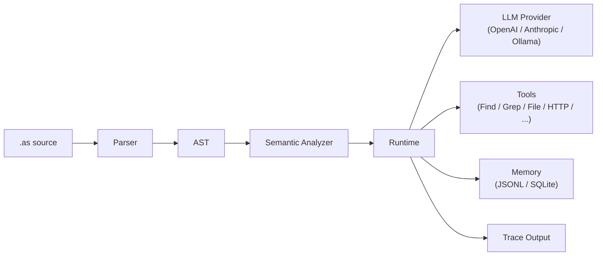

# AgentScript

> **Agent context as code.**
> `use` 声明模型能看到什么，并可用 label 标注 prompt section。
> `generate` 定义唯一的 LLM 调用点及其返回结构。
> 零运行时依赖。TypeScript 构建。

```agentscript
use scratch.summary max 2k as observations
generate({
    input: "Answer from observations"
}) -> {
    ok boolean
    text string
}
```

[](LICENSE)


[English](./README.md)

## 安装

```bash
npm install -g @rong/agentscript
```

然后运行 CLI：

```bash
agentscript --help
```

或者免安装运行：

```bash
npx @rong/agentscript recipes/code-review.as --input '{"path":"src"}'
```

## 快速开始

```bash
# 使用 mock LLM（默认，无需 API key）
agentscript recipes/summarize-file.as --input '{"path":"README.md"}'

# 使用真实 LLM
agentscript recipes/summarize-file.as --input '{"path":"README.md"}' --real-llm
```

`recipes/summarize-file.as` 读取本地文件，将其放入 LLM 上下文，并返回结构化摘要：

```agentscript
-- recipes/summarize-file.as
import llm Qwen from "ollama://localhost:11434/qwen3.6"
import tool File from "file://workspace"

main agent FileSummarizer {
    model Qwen
    role "Technical Writer"
    description "Read one local file and produce a useful structured summary."

    main func(input { path string }) {
        content = File.read({
            path: input.path
        })
        use input.path as source path
        use content max 8k as file content

        generate({
            input: "Summarize the file for a busy teammate",
            max_output: 1000
        }) -> {
            title string
            summary string
            key_points list[string]
            action_items list[string]
        }
    }
}
```

使用 mock LLM 的预期输出：

```json
{
  "value": {
    "title": "",
    "summary": "",
    "key_points": [],
    "action_items": []
  },
  "trace": [ ... ]
}
```

加上 `--real-llm` 后，字段将由模型填充。

`generate` 后面的 block 是返回结构 schema，不是普通对象构造。

## Examples、Tutorials 和 Recipes

- `examples/` 放最小化示例，每个文件只演示一个语言特性或 agent pattern。
- `tutorials/` 放更完整的 walkthrough 程序，用于学习端到端的多步骤 agent pattern。
- `recipes/` 放可直接复制改造的实际工作流，例如 code review、changelog、文件摘要、文档翻译、API 数据抽取和 research brief。

先看 `examples/structured-generate.as` 学语法，再读 `tutorials/` 理解模式，最后到 `recipes/` 找接近真实任务的模板。

## 解决什么问题

LLM 天生无记忆。每次调用都是一张白纸。要让 Agent 获得连续思维的能力，每次输入到 LLM 的内容都必须精心组织——这被研究者与开发者总结为上下文工程（context engineering）。

作者在长期使用 Python 和 TypeScript 编写 Agent 的过程中，反复遇到同一个问题：prompt 上下文管理。哪些数据真正进入了 LLM？一个 Agent 的上下文在哪里结束、另一个在哪里开始？如何审计模型到底看到了什么？

## AgentScript 有什么不同？

AgentScript 不是：

- prompt template
- YAML 配置格式
- 通用 Agent 框架

它是一门专注于一件事的小语言：

> 让 LLM prompt context 显式、作用域化、类型化、可追踪、可编译。

它提供了通用语言给不了的两个东西：一个一等公民的 `use` 关键字，声明 *哪些* 数据进入 LLM prompt，并通过 `as label` 标注这些 context 的用途；一个一等公民的 `generate` 表达式，定义 LLM *必须返回什么*。除此之外的一切——变量、函数、Agent、import、循环——都是为了支撑这个核心工作流。作用域天然地强制执行上下文边界：一个函数里的 `use` 不会泄漏到外面；子作用域继承父作用域，但从不向上泄漏。

## 工作原理



## 状态

AgentScript 仍处于实验阶段。

当前已实现：

- parser
- semantic checker
- mock runtime
- OpenAI / Anthropic / Ollama LLM adapters
- file 和 environment tools
- JSONL 和 SQLite memory backends
- trace output

计划中：

- stable IR
- 更丰富的诊断信息
- VS Code syntax support
- package publishing hardening

## Agent 模式，可组合的原语

AgentScript 不把 agent 模式硬编码为关键词。你用相同的基础原语组合它们：

| 模式 | 教程 | 演示内容 |
|------|------|----------|
| **ReAct** | `tutorials/react.as` | 思考→行动→观察循环，上下文显式传递 |
| **Plan-and-Execute** | `tutorials/plan-execute.as` | 生成计划、逐步执行、验证、失败后重新规划 |
| **Reflection / Self-Improvement** | `tutorials/self-improve.as` | 查询历史经验→生成→反思→持久化新经验 |
| **Multi-Agent** | `tutorials/plan-execute.as` | 独立 Agent 调用，上下文边界完全隔离 |

每种模式都显式声明：哪些数据进入 prompt、每个 Agent 可用什么工具、每次 LLM 调用必须满足的输出结构。

## 语言速览

```agentscript
import llm Qwen from "ollama://localhost:11434/qwen3.6"
import tool Search from "mcp://tools/search"
import memory Lessons from "file://./.agentscript/lessons.jsonl"

main agent ResearchAgent {
    model Qwen
    role "Senior Researcher"
    description "Answer questions with search and structured reasoning."

    main func(input {
        question string
    }) {
        use input.question as user question

        scratch = []
        use scratch.summary max 2k as observations

        done = false
        loop until done max 6 {
            thought = reason(input.question, scratch)
            obs = Search.search(thought.focus)
            scratch.add(obs)
            done = enough(input.question, scratch)
        }

        answer(input.question, scratch)
    }

    func answer(question, scratch) {
        use question as user question
        use scratch.summary max 2k as observations
        generate({
            input: "Answer using only the observations"
        }) -> {
            ok boolean
            text string
            error string
        }
    }
}
```

## 六个核心概念

1. **`use` 显式声明上下文** —— 未被 `use` 的变量不会进入 LLM prompt；`as label` 标注 context section
2. **`generate` 是唯一的 LLM 调用点** —— 必须包含 input 指令，可选择声明输出 shape
3. **Final expression return 让流程更简洁** —— 函数返回最后一个顶层表达式
4. **作用域即上下文边界** —— 函数、Agent、块级作用域隔离 prompt 可见性
5. **工具、memory、文件都是导入资源** —— 访问可审计
6. **内置 Trace** —— 每次 `generate` 和 `use` 都被记录，便于调试

## 为什么不用 Python 或 TypeScript？

| | Python / TypeScript | AgentScript |
|---|---|---|
| 上下文管理 | 隐式（字符串拼接、数组 append） | 显式（`use` 声明，可选 `as label`） |
| LLM 调用点 | 代码任意位置 | 唯一的 `generate` 表达式 |
| 上下文隔离 | 靠开发者自律 | 作用域继承，自动隔离 |
| Trace / 审计 | 需要额外工具 | 内置，每次调用自动记录 |

Python 和 TypeScript 是优秀的通用工具，但它们没有"prompt 上下文"这个语言概念。每个 Agent 项目都在重复发明相同的模式。AgentScript 把它们做进了语言里。

## CLI

```bash
agentscript recipes/code-review.as --input '{"path":"src"}'
agentscript recipes/code-review.as --check
agentscript examples/react.as --parse
agentscript recipes/code-review.as --trace pretty
agentscript recipes/code-review.as --quiet
```

| 选项 | 说明 |
|------|------|
| `--input '<json>'` | 入口函数的 JSON 输入 |
| `--input-file <路径>` | 从 JSON 文件读取输入 |
| `--agent <名称>` | 选择入口 agent |
| `--function <名称>` | 选择入口函数 |
| `--check` | 解析 + 语义分析（不执行） |
| `--parse` | 解析并输出 AST 为 JSON |
| `--real-llm` | 使用真实 LLM provider |
| `--trace <文件>` | 将 trace 写入文件 |
| `--trace pretty` | 打印可读的 trace |
| `--verbose` | 打印详细 trace |
| `--quiet` | 仅输出最终结果 |

## 文档

| 语言 | 链接 |
|------|------|
| 中文 | [README-CN](./README-CN.md) · [语言参考](docs/cn/language.md) · [Context Engineering](docs/cn/context-engineering.md) · [`use ... as ...`](docs/cn/use-as.md) · [`generate`](docs/cn/generate.md) |
| English | [Language Reference](docs/en/language.md) · [Context Engineering](docs/en/context-engineering.md) · [`use ... as ...`](docs/en/use-as.md) · [`generate`](docs/en/generate.md) · [Design History](docs/design-history/) |

### 设计原则

- 上下文显式化：普通变量、工具结果、memory 记录和 trace 事件都不会自动进入 prompt，除非通过 `use` 显式选择。
- 作用域控制变量生命周期、上下文继承和 prompt 暴露边界。
- import 的 llm、tool、file、agent 和 memory 是具有明确边界的运行时能力。
- planner、executor、verifier、reflect、improve 和 evolve 等模式名只是普通标识符。
- Trace 是调试和审计产物，不是 prompt context。

## 贡献

参见 [CONTRIBUTING.md](./CONTRIBUTING.md)。

## 开发验证

```bash
npm run typecheck
npm test
npm run build
```

零运行时依赖。TypeScript 构建。

## License

MIT
