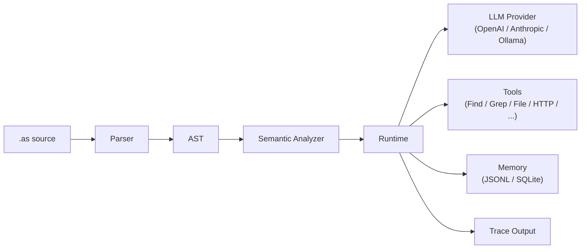

# AgentScript

> **Prompt context as a first-class citizen.**  
> `use` declares what the model sees. `generate` defines what it returns.  
> Zero runtime dependencies. TypeScript-powered.

```agentscript
use scratch.summary < 2k
return generate({ input: "Answer from observations" }) {
    return { ok boolean, text string }
}
```

[](LICENSE)


[中文版](./README-CN.md)

LLMs are stateless by nature. Each call is a fresh start. To give an agent continuity of thought, every input must be carefully assembled — what researchers and practitioners call context engineering.

After building agents with Python and TypeScript, the author kept running into the same problem: prompt context management. What data actually reaches the LLM? Where does one agent's context end and another's begin? How do you audit what the model saw?

AgentScript was designed to solve this — not as a general-purpose language, nor a declarative config, nor a prompt template, but as a **DSL** that mixes imperative control flow with explicit, scope-governed context declarations.

It gives you two things that general-purpose languages don't: a first-class `use` keyword that declares *which* data enters the LLM prompt, and a first-class `generate` expression that defines *what* the LLM must return. Everything else — variables, functions, agents, imports, loops — exists to support this core workflow. Scopes enforce context boundaries naturally: what's `use`d in one function stays there; child scopes inherit but never leak upward.

The result is a language purpose-built for composing agent patterns — ReAct, Plan-and-Execute, Reflection, Multi-Agent — where prompt context is always visible, auditable, and under your control.

## How it works



## Agent patterns as composable primitives

AgentScript doesn't hardcode agent patterns as keywords. You compose them from the same primitives:

| Pattern | Tutorial | What it demonstrates |
|---------|----------|---------------------|
| **ReAct** | `tutorials/react.as` | Reason → Act → Observe loop with explicit context |
| **Plan-and-Execute** | `tutorials/plan-execute.as` | Generate plan, execute steps, verify, re-plan on failure |
| **Reflection / Self-Improvement** | `tutorials/self-improve.as` | Query past lessons → generate → reflect → persist new lessons |
| **Multi-Agent** | `tutorials/plan-execute.as` | Independent agents with isolated context boundaries |

Every pattern is explicit — which data enters the prompt, which tools each agent can use, and which output shape each LLM call must satisfy.

## Install

```bash
npm install -g agentscript
```

Or run without installing:

```bash
npx agentscript examples/review.as --input '{"path":"src"}'
```

## Quick start

```bash
# Run with mock LLM (default, no API key needed)
agentscript examples/summarize.as --input '{"path":"README.md"}'

# Run with real LLM
agentscript examples/summarize.as --input '{"path":"README.md"}' --real-llm
```

The `summarize.as` file reads a local file, includes it in the LLM context, and returns a structured summary:

```agentscript
-- examples/summarize.as
import llm Qwen from "ollama://localhost:11434/qwen3.6"
import tool File from "file://workspace"

main agent FileSummarizer {
    model Qwen
    role "Technical Writer"
    description "Read one local file and produce a useful structured summary."

    main func(input { path string }) {
        content = File.read({ path: input.path })
        use input.path
        use content < 8k

        return generate({
            input: "Summarize the file for a busy teammate"
            limit: 1000
        }) {
            return {
                title string
                summary string
                key_points list[string]
                action_items list[string]
            }
        }
    }
}
```

Expected output (with mock LLM):

```json
{
  "value": {
    "title": "",
    "summary": "",
    "key_points": [],
    "action_items": []
  },
  "trace": [ ... ]
}
```

With `--real-llm`, the fields are populated by the model.

## Language at a glance

```agentscript
import llm Qwen from "ollama://localhost:11434/qwen3.6"
import tool Search from "mcp://tools/search"
import memory Lessons from "file://./.agentscript/lessons.jsonl"

main agent ResearchAgent {
    model Qwen
    role "Senior Researcher"
    description "Answer questions with search and structured reasoning."

    main func(input {
        question string
    }) {
        use input.question

        scratch = []
        use scratch.summary < 2k

        done = false
        loop until done < 6 {
            thought = reason(input.question, scratch)
            obs = Search.search(thought.focus)
            scratch.add(obs)
            done = enough(input.question, scratch)
        }

        return answer(input.question, scratch)
    }

    func answer(question, scratch) {
        use question
        use scratch.summary < 2k
        return generate({ input: "Answer using only the observations" }) {
            return {
                ok boolean
                text string
                error string
            }
        }
    }
}
```

## Key ideas

1. **`use` is explicit context** — nothing enters the LLM prompt unless `use`d
2. **`generate` is the only LLM call site** — with a required input instruction and a return shape
3. **Scope is context boundary** — functions, agents, and blocks isolate prompt visibility
4. **Tools, memory, and files are imported resources** — with auditable access
5. **Trace is built in** — every `generate` and `use` is recorded for debugging

## Why not just Python or TypeScript?

| | Python / TypeScript | AgentScript |
|---|---|---|
| Context management | Implicit (string concatenation, array append) | Explicit (`use` declaration) |
| LLM call site | Anywhere in the code | One `generate` expression |
| Context isolation | Manual discipline | Scope-inherited, auto-isolated |
| Trace / audit | External tooling needed | Built-in, per-call |

Python and TypeScript are excellent general-purpose tools, but they have no concept of "prompt context" as a language primitive. Every agent project reinvents the same patterns. AgentScript bakes them in.

## CLI

```bash
agentscript examples/review.as                       # run with mock LLM
agentscript examples/review.as --check               # parse + semantic check only
agentscript examples/review.as --parse               # parse and output AST
agentscript examples/review.as --trace pretty        # human-readable trace
agentscript examples/review.as --quiet               # value only, no trace
```

| Option | Description |
|--------|-------------|
| `--input '<json>'` | JSON input for the entry function |
| `--input-file <path>` | Read input from a JSON file |
| `--agent <name>` | Select a specific entry agent |
| `--function <name>` | Select a specific entry function |
| `--check` | Parse + semantic analysis (no execution) |
| `--parse` | Parse and output AST as JSON |
| `--real-llm` | Use real LLM provider instead of mock |
| `--trace <file>` | Write execution trace to file |
| `--trace pretty` | Print human-readable trace |
| `--verbose` | Print detailed trace |
| `--quiet` | Output only the final value |

## Documentation

| Language | Links |
|----------|-------|
| English | [Language Reference](docs/en/language.md) · [Context Engineering](docs/en/context-engineering.md) · [Design History](docs/design-history/) |
| 中文 | [README-CN](./README-CN.md) · [语言参考](docs/cn/language.md) · [Context Engineering](docs/cn/context-engineering.md) |

### Design principles

- Context is explicit: ordinary variables, tool results, memory records, and trace events never enter prompts unless selected with `use`.
- Scope controls variable lifetime, context inheritance, and prompt exposure.
- LLM, tool, file, agent, and memory imports are runtime capabilities with explicit boundaries.
- Pattern names such as planner, executor, verifier, reflect, improve, and evolve are ordinary identifiers.
- Trace is for debugging and audit; it is not prompt context.

## Contributing

See [CONTRIBUTING.md](./CONTRIBUTING.md).

## Development

```bash
npm run typecheck
npm test
npm run build
```

Zero runtime dependencies. Built with TypeScript.

## License

MIT