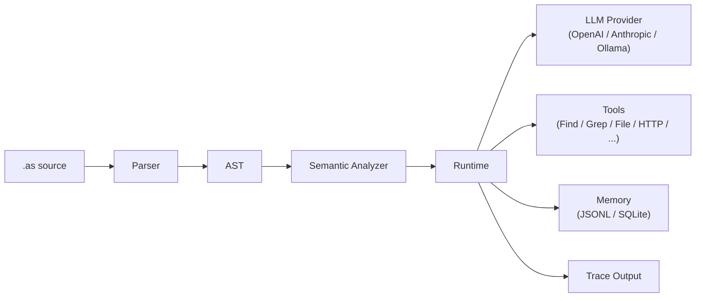

# AgentScript

> **Agent context as code.**
> `use` declares what the model can see, with optional labels for prompt sections.
> `generate` defines the only LLM call site and optional output contract.
> Zero runtime dependencies. TypeScript-powered.

```agentscript
use scratch.summary max 2k as observations
generate({
    input: "Answer from observations"
}) -> {
    ok: boolean
    text
}
```

[](LICENSE)


[中文版](./README-CN.md)

Documentation website: [https://rongzhou.github.io/agentscript/](https://rongzhou.github.io/agentscript/)

<p align="center">
  
</p>

Traditional chat lets context grow and mix until important signals get buried.
AgentScript keeps program state separate from model context: only data selected
with `use` enters a `generate` call.

## Install

```bash
npm install -g @rong/agentscript
```

Then run the CLI:

```bash
agentscript --help
```

Or run without installing:

```bash
npx @rong/agentscript recipes/code-review.as --input '{"path":"src"}'
```

## Quick start

```bash
# Real model call by default
agentscript recipes/summarize-file.as --input '{"path":"README.md"}'

# Mock override for deterministic local checks
agentscript recipes/summarize-file.as --input '{"path":"README.md"}' --mock

# Dry-run inspection without model calls
agentscript recipes/summarize-file.as --input '{"path":"README.md"}' --dry-run

# Audit trace
agentscript recipes/summarize-file.as --input '{"path":"README.md"}' --trace

# Optimize a target AgentScript program locally
agentscript examples/optimizer/optimizer.as examples/optimizer/triage.as --mock \
  --request "Checkout is failing with 500 errors in production" \
  --selection '{"examples/optimizer/triage.as#Triage.main[style]":"detailed"}' \
  --write preview \
  --trial-trace none
```

The `recipes/summarize-file.as` recipe reads a local file, includes it in the LLM context, and returns a structured summary:

```agentscript
// recipes/summarize-file.as
import llm Qwen from "ollama://localhost:11434/qwen3.6"
import tool File from "file://workspace"

main agent FileSummarizer {
    model Qwen
    role "Technical Writer"
    description "Read one local file and produce a useful structured summary."

    main func(input { path: string }) {
        file = File.read({
            path: input.path
        })
        use input.path as "source path"
        use file.content max 8k as "file content"

        generate({
            input: "Summarize the file for a busy teammate",
            max_output: 1000
        }) -> {
            title
            summary
            key_points: list[string]
            action_items: list[string]
        }
    }
}
```

Expected output (with mock LLM):

```json
{
  "value": {
    "title": "",
    "summary": "",
    "key_points": [],
    "action_items": []
  },
  "trace": [ ... ]
}
```

Trace makes the prompt inputs auditable:

```text
use "source path"       value="README.md"
use "file content"      budget=8k clipped=true
generate                input="Summarize the file for a busy teammate"
schema                  title, summary, key_points, action_items
validation              ok
```

Use `--mock` when you want deterministic local output without real model, tool, or memory calls. Without `--mock` or `--dry-run`, AgentScript calls the configured real model.

The optional block after `generate` is an output schema, not ordinary object construction.

## Examples, tutorials, and recipes

- `examples/` contains minimal examples. Each file demonstrates one language feature or agent pattern.
- `examples/optimizer/` contains a mockable V6 optimizer workflow using `host://optimizer`.
- `tutorials/` contains longer walkthrough programs for learning multi-step agent patterns end to end.
- `recipes/` contains practical workflows you can copy and adapt, such as repo review, code review, changelog drafting, file summarization, document translation, API extraction, and research briefs.

Start with `examples/structured-generate.as` to learn the syntax, `examples/arithmetic.as` for operators, `examples/plan-execute.as` for `parallel for`, read `tutorials/` for pattern walkthroughs, then use `recipes/repo-review.as` when you want a realistic, auditable repository workflow.

`recipes/repo-review.as` shows the core difference: tool results are not automatically prompt context. The recipe explicitly selects only the file tree, TODO/FIXME findings, package metadata, and CI configuration before asking for structured release-readiness output:

```text
use "file tree"          budget=8k
use "todo findings"      budget=4k
use "package metadata"   budget=4k
use "ci configuration"   budget=4k
generate                 blockers, risks, quick_wins, next_steps
```

## What problem it solves

LLMs are stateless by nature. Each call is a fresh start. To give an agent continuity of thought, every input must be carefully assembled — what researchers and practitioners call context engineering.

After building agents with Python and TypeScript, the author kept running into the same problem: prompt context management. What data actually reaches the LLM? Where does one agent's context end and another's begin? How do you audit what the model saw?

## What makes AgentScript different?

AgentScript is not:

- a prompt template
- a YAML config format
- a general-purpose agent framework

It is a small language for one thing:

> making LLM prompt context explicit, scoped, typed, traceable, and compilable.

It gives you two things that general-purpose languages don't: a first-class `use` keyword that declares *which* data enters the LLM prompt and what role it plays via `as label`, and a first-class `generate` expression that defines an LLM call with an optional output contract. Everything else — variables, functions, agents, imports, loops — exists to support this core workflow. Scopes enforce context boundaries naturally: what's `use`d in one function stays there; child scopes inherit but never leak upward. Functions can also return their final top-level expression directly, which keeps typical LLM workflows concise.

## How it works



## Status

AgentScript is experimental.

Currently implemented:

- parser
- semantic checker
- mock runtime
- OpenAI / Anthropic / Ollama LLM adapters
- file and environment tools
- MCP stdio tool provider
- JSONL and SQLite memory backends
- trace output

Planned:

- stable IR
- richer diagnostics
- VS Code syntax support
- package publishing hardening

## Agent patterns as composable primitives

AgentScript doesn't hardcode agent patterns as keywords. You compose them from the same primitives:

| Pattern | Tutorial | What it demonstrates |
|---------|----------|---------------------|
| **ReAct** | [`tutorials/react.as`](./tutorials/react.as) | Reason → Act → Observe loop with explicit context |
| **Plan-and-Execute** | [`tutorials/plan-execute.as`](./tutorials/plan-execute.as) | Generate a plan, execute independent steps, synthesize results |
| **Multi-Agent** | [`tutorials/multi-agent.as`](./tutorials/multi-agent.as) | Independent agents with isolated context boundaries |
| **Multi-Agent Review** | [`tutorials/multi-agent-review.as`](./tutorials/multi-agent-review.as) | Run specialist reviewers in parallel, then consolidate feedback |
| **Reflection / Self-Improvement** | [`tutorials/memory-reflection.as`](./tutorials/memory-reflection.as) | Query past lessons → generate → reflect → persist new lessons |

Every pattern is explicit — which data enters the prompt, which tools each agent can use, and which output contract each LLM call must satisfy when one is declared.

## Language at a glance

```agentscript
import llm Qwen from "ollama://localhost:11434/qwen3.6"
import tool Search from "mcp://tools/search"
import memory Lessons from "file://./.agentscript/lessons.jsonl"

main agent ResearchAgent {
    model Qwen
    role "Senior Researcher"
    description "Answer questions with search and structured reasoning."

    main func(input {
        question: string
    }) {
        use input.question as "user question"

        scratch = []
        use scratch.summary max 2k as observations

        done = false
        loop until done max 6 {
            thought = reason(input.question, scratch)
            obs = Search.search(thought.focus)
            scratch.add(obs)
            done = enough(input.question, scratch)
        }

        answer(input.question, scratch)
    }

    func answer(question, scratch) {
        use question as "user question"
        use scratch.summary max 2k as observations
        generate({
            input: "Answer using only the observations"
        }) -> {
            ok: boolean
            text
            error
        }
    }
}
```

## Key ideas

1. **`use` is explicit context** — nothing enters the LLM prompt unless `use`d; `as label` names the context section
2. **`generate` is the only LLM call site** — with a required input instruction and optional output contract
3. **Final expression return keeps flows concise** — a function returns its final top-level expression
4. **Scope is context boundary** — functions, agents, and blocks isolate prompt visibility
5. **Tools, memory, and files are imported resources** — with auditable access
6. **Trace is built in** — every `generate` and `use` is recorded for debugging

## MCP stdio tools

AgentScript can call MCP tools through `mcp://` tool imports. Current MCP support
is stdio-only and does not add runtime dependencies.

Configure servers in `agentscript.mcp.json` at the workspace root:

```json
{
  "mcpServers": {
    "search": {
      "transport": "stdio",
      "command": "npx",
      "args": ["-y", "@example/mcp-server-search"],
      "env": {
        "SEARCH_API_KEY": "$SEARCH_API_KEY"
      }
    }
  }
}
```

Then import and call the server:

```agentscript
import tool Search from "mcp://search"

main agent Researcher {
    main func(input { query: string }) {
        result = Search.call({
            tool: "web-search",
            args: {
                query: input.query
            }
        })

        use result.text max 4k as "search results"
        generate({ input: "Answer from the selected search results" }) -> {
            answer
        }
    }
}
```

MCP results are ordinary data. They enter model context only when selected with
`use`.

## npm and node tools

AgentScript can also call explicitly allowed Node built-in modules and installed
npm packages through `node:` and `npm:` tool imports.

```agentscript
import tool Crypto from "node:crypto"

main agent NodeCryptoExample {
    main func(input { label: string }) {
        run_id = Crypto.randomUUID()
        digest = Crypto.hash("sha256", input.label, "hex")

        return {
            label: input.label,
            run_id: run_id,
            digest: digest
        }
    }
}
```

Enable the capability in `agentscript.npm.json`:

```json
{
  "allow": {
    "node": ["crypto"],
    "npm": {}
  }
}
```

For a hands-on walkthrough, see
[TypeScript and Node Interop](https://rongzhou.github.io/agentscript/docs/tutorials/typescript-interop).

## TypeScript API

The package root exports only stable runtime entry points. Public types that are
useful for embedding are exposed through explicit subpaths:

```ts
import { executeAgent, parse } from "@rong/agentscript";
import type { ExecuteOptions, RuntimeValue } from "@rong/agentscript/runtime/types";
import type { Program } from "@rong/agentscript/ast/types";
```

## Why not just Python or TypeScript?

| | Python / TypeScript | AgentScript |
|---|---|---|
| Context management | Implicit (string concatenation, array append) | Explicit (`use` declaration, optional `as label`) |
| LLM call site | Anywhere in the code | One `generate` expression |
| Context isolation | Manual discipline | Scope-inherited, auto-isolated |
| Trace / audit | External tooling needed | Built-in, per-call |

Python and TypeScript are excellent general-purpose tools, but they have no concept of "prompt context" as a language primitive. Every agent project reinvents the same patterns. AgentScript bakes them in.

## CLI

```bash
agentscript recipes/code-review.as --input '{"path":"src"}'
agentscript recipes/code-review.as --input '{"path":"src"}' --mock
agentscript recipes/code-review.as --input '{"path":"src"}' --dry-run
agentscript recipes/code-review.as --input '{"path":"src"}' --trace
agentscript recipes/code-review.as --input '{"path":"src"}' --trace-file trace.json
agentscript recipes/code-review.as --check
agentscript examples/arithmetic.as --parse
agentscript recipes/code-review.as --quiet
```

| Option | Description |
|--------|-------------|
| `--input '<json>'` | JSON input for the entry function |
| `--input-file <path>` | Read input from a JSON file |
| `--agent <name>` | Select a specific entry agent |
| `--function <name>` | Select a specific entry function |
| `--check` | Parse + semantic analysis (no execution) |
| `--parse` | Parse and output AST as JSON |
| `--mock` | Use deterministic mock providers instead of real model, tool, or memory calls |
| `--dry-run` | Build prompts and trace without model calls |
| `--concurrency <n>` | Set the runtime concurrency limit for `parallel for` |
| `--trace` | Print human-readable trace |
| `--trace-file <path>` | Write execution trace to a JSON file |
| `--verbose` | Print detailed trace |
| `--quiet` | Output only the final value |

## Documentation

Documentation website: [https://rongzhou.github.io/agentscript/](https://rongzhou.github.io/agentscript/)

### Design principles

- Context is explicit: ordinary variables, tool results, memory records, and trace events never enter prompts unless selected with `use`.
- Scope controls variable lifetime, context inheritance, and prompt exposure.
- LLM, tool, file, agent, and memory imports are runtime capabilities with explicit boundaries.
- Pattern names such as planner, executor, verifier, reflect, improve, and evolve are ordinary identifiers.
- Trace is for debugging and audit; it is not prompt context.

## Contributing

See [CONTRIBUTING.md](./CONTRIBUTING.md).

## Development

```bash
npm run typecheck
npm test
npm run build
```

Zero runtime dependencies. Built with TypeScript.

## License

MIT
