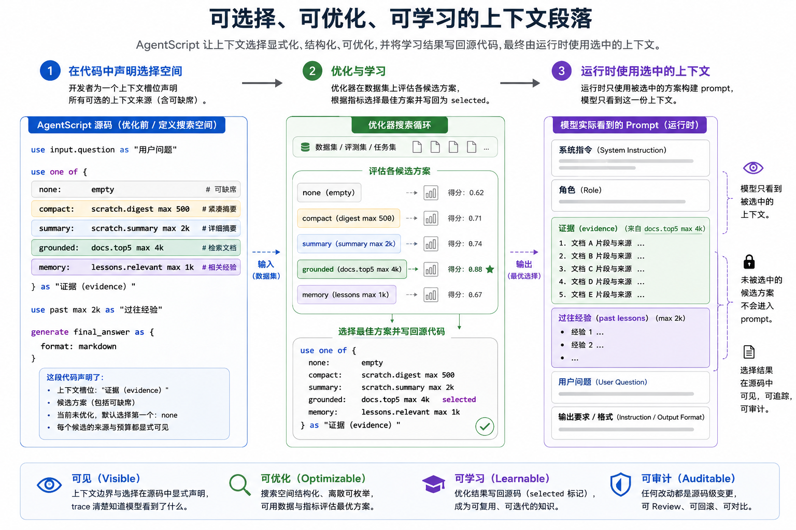

# 别再死磕提示词优化，真正该优化的是上下文
本文为 AgentScript 系列第二篇，承接上篇「模型到底看到了什么？」，提出一个核心认知：**Agent 开发的核心优化方向，不是打磨提示词话术，而是管控模型可见的上下文信息**。

提示词优化，是提示词工程之后最顺理成章的进阶方向。
既然手写提示词脆弱、不稳定，那就交给优化器自动迭代：调整指令措辞、挑选示例、基于数据与指标编译出更优质的提示词。

这个思路本身合理，也诞生了不少实用工具。最典型的代表就是 DSPy，它将自身定位为**面向大模型的编程框架**，而非简单的提示词工具；内置优化器可以根据自定义指标，自动调优程序内的提示词甚至模型权重。

但对绝大多数智能体（Agent）而言，**提示词优化并不是优先级最高的优化目标**。

问题不在于提示词不重要。
而是：**提示词往往不该是最先优化的部分**。

一个 Agent 的完整提示词，从来不是单纯的一句指令，而是多部分混合而成：
```
完整提示词 = 系统指令 + 角色设定 + 上下文数据 + 示例 + 用户指令
```

常规的提示词优化，大多只聚焦指令相关部分：措辞润色、示例选择、任务话术调整、Few‑Shot 样例设计。
可实际上，**Agent 的行为表现，更多由上下文数据决定**：检索文档、工具返回结果、记忆记录、中间状态、历史输出、摘要引用、其他智能体的返回内容。

只要模型能看到正确的证据，哪怕指令平平无奇，也能给出不错的结果；
反之，如果模型获取的信息本身有误，再精妙的指令，只会让错误答案看起来更通顺、更像真的。

本文要讲的，就是另一个更关键的优化目标：
> 不要只优化你对模型说了什么，更要优化**模型能看到什么**。

<p align="center">
  
</p>

## 提示词，不是智能体的最小单元
单次大模型调用中，提示词似乎是天然的优化单元。
我们写指令、给示例、测试输出、微调话术，一套流程非常直观。

但这套思维，放到 Agent 多轮执行场景里就彻底失效了。
Agent 不止有一个固定提示词，它拥有**不断变化的上下文边界**。

一个科研类智能体，上下文通常包含：
- 用户原始问题
- 检索关键词
- 搜索结果
- 召回文档
- 文档摘要
- 历史运行记忆
- 中间观测信息
- 失败尝试记录
- 工具调用异常
- 辅助智能体的输出
- 最终答案格式约束

这些信息里，一部分需要传入下一轮模型调用，另一部分则必须过滤。

Agent 出问题，很少是因为：
> 指令描述不够清晰。

更多是因为这三类问题：
> 模型看到了错误的上下文。
>
> 正确的上下文存在于程序中，却没有传入提示词。
>
> 上下文传入了，但格式、粒度不对。

工具返回内容过长、记忆查询到过时信息、摘要丢失关键引用、规划步骤需要精简摘要而回答步骤需要完整原文……
这些本质都不是话术问题，而是**上下文选择问题**。

## 提示词文本：一个极难优化的软变量
提示词优化听起来很美好：用算法替代人工反复调试。
以 DSPy 的 MIPROv2 为例，它可以联合优化指令与 Few‑Shot 示例，基于下游任务指标，在无梯度、无模块标签的前提下，优化多阶段模型程序。
这是非常扎实且有价值的研究方向。

但它优化的对象，本质上是**软性变量**。
提示词文本存在这些天然缺陷：
- 维度极高、自由文本无约束
- 高度依赖特定模型特性
- 约束困难、语义难以量化对比
- 极易过拟合
- 效果好时难以解释，效果差时难以排查

对比两次提示词的修改，只能看到文字变化，却很难解释系统为什么变得更稳定：
是指令本身真的更好？
还是某句话刚好契合当前模型的行为偏好？
还是示例刚好贴合验证集？
还是优化器找到了一个会随模型迭代失效的小技巧？
还是下游评估指标本身不完善？

这些问题不是否定提示词优化的价值，而是说明：**自由文本形式的提示词，是一个非常难优化的目标**。
它太贴近模型本身的黑盒行为，却远离了 Agent 内部真实的数据流问题。

## 上下文，才是更优质的优化目标
上下文和提示词完全不同。
上下文的核心不是一句话，而是**一系列结构化决策**：

模型该看原始工具结果，还是精简摘要？
该看前3条文档，还是前10条？
该读取近期记忆、长期经验，还是完全不使用记忆？
该保留带引用的原文片段，还是压缩后的观测总结？
最终回答步骤需要完整证据，规划步骤是否只需要极简摘要？

这些都是清晰、可枚举的结构化选择：
- 不使用上下文
- 精简摘要
- 常规总结
- 高相关文档
- 带引用的原文片段
- 记忆+文档组合

同时它也更容易排查、追踪：
- 本次运行用了前5条文档，token上限4k
- 本次运行用了精简摘要，上限500token
- 本次运行完全禁用记忆

上下文优化的结果，**跨模型兼容性更强**。
不同模型对话术敏感度差异巨大，但“是否使用召回文档”这个决策，几乎不受模型版本影响。GPT、Claude、Gemini、Qwen 等，无论风格差异多大，都依赖正确的信息输入。

上下文优化同样可能过拟合，在一类场景有效、另一类场景失效。
但它的优势在于：**出问题时可观测、可定位**。
你能清晰看到选了哪些信息、过滤了哪些信息、模型是否获取了关键证据。你修改的是结构化决策，而非模糊的话术。

## 从提示词工程，走向上下文工程
提示词工程关心的是：
> 我该对模型说什么？

上下文工程关心的是：
> 模型该看到什么？

这个转变至关重要。

在常规 Python / TypeScript 编写的 Agent 中，上下文通常以字符串、消息数组、框架对象、模板的形式存在。本地数据与提示词的边界，全靠开发者的编码习惯维持。

而 AgentScript 从一开始就定下更严格的规则：
> 本地数据，默认不是提示词上下文。

工具返回、记忆查询结果、中间观测、执行日志、其他智能体输出，**不会自动混入提示词**。
如果需要让模型读取某份数据，必须通过 `use` 显式声明。

```agentscript
use input.question as "用户问题"
use docs.summary max 4k as "参考证据"
use past max 2k as "过往经验"
```

这是第一步：让上下文变得**可见、可控**。
一条 `use` 语句直接定义：数据来源、分类标签、token上限，它不再是一段模板字符串，而是一份**上下文契约**。

自然而然就走到了下一步：
既然上下文可以显式定义，那上下文的备选方案，同样可以显式定义。

## use one of：把上下文搜索空间写进代码
AgentScript 用语法直接表达上下文的多种可选方案：
```agentscript
use one of {
    none:     empty
    compact:  scratch.digest max 500
    verbose:  scratch.summary max 4k
    grounded: docs.top5 max 4k selected
} as "参考证据"
```

含义非常直白：
- 存在一个名为「参考证据」的上下文模块
- 可以选择完全不使用
- 可以使用极简摘要
- 可以使用常规总结
- 可以使用带原文的高相关文档
- 当前生效的方案是「带原文文档」

这里没有运行时魔法，没有隐藏的自动优化器，没有后台学习状态。
只是**声明可选的上下文来源 + 标记当前最优选择**。
`use one of` 定义搜索空间，`selected` 标记当前启用方案，`empty` 代表完全不启用。

模型不会看到备选列表，只会读取被选中的上下文内容。
如果选中原文文档，提示词就加载对应内容；
如果选中 none，该模块直接不出现。
全程可审计、运行时逻辑极简。

## 为什么“不启用”也要纳入统一机制
很多人会想：给可选上下文单独设计语法不就行了？
比如：
```agentscript
use? docs.top5 max 4k as "参考证据"
```

但这会让上下文可选性，变成另一套独立语法，增加语言复杂度。
更简洁的设计，是把「不启用」也作为一种备选方案：
```agentscript
use one of {
    none: empty
    docs: docs.top5 max 4k
} as "参考证据"
```

可读性更强，优化也更简单。
搜索空间一目了然：参考证据 = {不启用, 文档}。
默认规则同样清晰：写在最前的方案为默认方案。
无需额外语法，**上下文的有无，本身就是一种决策**。

## selected：优化结果直接固化在源码中
这套设计最关键的一点：**优化结果直接写在源代码里**。
不会藏在数据库、运行时配置、后台优化器状态中，而是和其他备选方案写在一起。

```agentscript
use one of {
    none:     empty
    compact:  scratch.digest max 500
    verbose:  scratch.summary max 4k
    grounded: docs.top5 max 4k selected
} as "参考证据"
```

程序自解释、可人工审查、可工具解析、可日志溯源。
版本控制的 diff 可以清晰展示变化：
```diff
 use one of {
     none:     empty
     compact:  scratch.digest max 500
-    verbose:  scratch.summary max 4k selected
-    grounded: docs.top5 max 4k
+    verbose:  scratch.summary max 4k
+    grounded: docs.top5 max 4k selected
 } as "参考证据"
```

这和传统提示词优化完全不同。
传统优化输出的是一段新话术；
上下文优化输出的，是**一次明确的工程决策**。

## 优化模式：源码到源码的特化
AgentScript 最干净的优化模型，就是**源码到源码的特化**。
优化器不需要修改运行时、注入隐藏状态、改写提示词文本，只做一件简单的事：
1. 读取 AgentScript 源码
2. 找到所有 `use one of` 位置
3. 评估每一种备选方案效果
4. 移动 `selected` 标记
5. 输出新的 AgentScript 源码

输入是 AgentScript，输出还是 AgentScript，运行时完全保持不变。

分两种可用形式：
- 开发版：保留全部备选方案，方便后续迭代、审计、再优化
```agentscript
use one of {
    none:     empty
    compact:  scratch.digest max 500
    verbose:  scratch.summary max 4k
    grounded: docs.top5 max 4k selected
} as "参考证据"
```
- 生产版：直接固化为最优方案，精简代码
```agentscript
use docs.top5 max 4k as "参考证据"
```
如果最优方案是不启用，则直接删除该模块。

两种形式都通俗易懂，不需要复杂的运行时学习机制。

## 运行时应当保持简单纯粹
这是整个语言设计的核心约束：**运行时不隐藏任何学习逻辑**。
执行时，`use one of` 只会解析为其中一种确定方案，规则完全确定：
- 标记了 `selected` → 启用该方案
- 无标记 → 启用第一个方案

被选中的方案，行为和普通 `use` 完全一致。
选中原文文档，等价于直接写 `use docs.top5...`；
选中不启用，等价于没有这段上下文。

没有动态改写提示词、没有后台配置覆盖、没有自适应状态、没有运行时自修改。
日志完全真实可信：日志显示模型读取了什么，源码里就对应什么选择。

## 为什么比提示词优化更可审计
提示词优化的产物，本质还是一段文本：
> 你是严谨精准的助手，请基于上下文回答……

优化后话术再漂亮，也是一段难以审查的内容。
审阅者只能看到文字改动，却很难判断行为变化、跨模型稳定性。

而上下文优化的 diff，直白清晰：
```diff
-    verbose:  scratch.summary max 4k selected
+    grounded: docs.top5 max 4k selected
```
翻译成人话：**模型现在读取原文文档，而非摘要**。

再比如：
```diff
-    lessons: Lessons.relevant(input.question) max 1k selected
+    none: empty selected
```
含义：**本轮不再给模型提供记忆信息**。

这些都是明确的工程决策：可审查、可追踪、可测试、可回滚。
讨论时不用纠结某句话术是否玄学，只需要讨论信息选择是否合理。

## 上下文优化同样需要评估
这套方案，不代表可以跳过评估环节。
优化器依旧需要评估信号：测试用例、验证输出、用户反馈、下游任务效果、人工评审。

上下文优化同样会过拟合：某套记忆策略在一类任务有效，另一类任务会造成信息污染；更多参考信息能提升真实性，但会增加延迟与成本。

核心区别不在于上下文优化绝对正确，而在于：**优化变量全部可见**。
出问题时，直接定位上下文选择；效果提升时，能清晰解释背后原因。

Agent 不是单次模型调用，而是完整程序。程序需要可审查的状态、明确的边界、可理解的变更，这正是上下文优化的优势。

## 对 AgentScript 的意义
AgentScript 的第一个核心理念：
> 智能体上下文，应当由代码定义。
这由 `use` 实现。

第二个核心理念：
> 上下文的全部可选空间，也应当由代码定义。
这由 `use one of` 实现。

这是从上下文工程，走向上下文优化的桥梁。
语言本身不需要做自适应话术、优化角色描述、动态修改控制流，只需要维持极简的核心模型：
- `use`：声明模型可见信息
- `generate`：声明模型调用位置与输出约束
- `one of`：声明上下文备选方案
- `selected`：标记当前最优选择
- `empty`：声明刻意不启用某类上下文

靠这几个基础原语，就能实现可审计、可迭代的上下文优化，同时不把复杂逻辑藏进运行时。

## 真正的问题
传统提示词工程问：
> 我该对模型说什么？

AgentScript 最初解决的问题：
> 模型到底看到了什么？

上下文优化新增的问题：
> 模型本可以看到哪些信息，我们为什么选择这一种？

这就是提示词优化和上下文优化的本质区别：
提示词优化，是在语言层面搜索；
上下文优化，是在证据、记忆、摘要、工具结果、token上限、信息取舍层面搜索。

对智能体而言，后者往往重要得多。
不是提示词不重要，而是在真实 Agent 程序中，模型输出的上限，很少由话术优美度决定，更多由输入信息的质量决定。

可靠的智能体，不止需要更好的提示词，更需要**显式、有作用域、可审计、可优化的上下文选择**。
这正是 AgentScript 正在探索的方向：
> 上下文即代码，上下文可选空间即代码，优化结果即代码。
