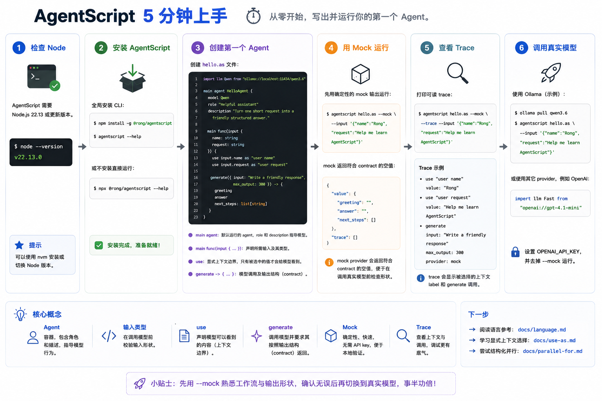

# 5 分钟上手 AgentScript

这篇教程从一个全新的终端开始，到写出并运行第一个 AgentScript agent 结束。第一次运行不需要 API key，因为我们会使用 `--mock`。



## 1. 检查 Node

AgentScript 需要 Node.js 22.13 或更新版本：

```bash
node --version
```

## 2. 安装 AgentScript

全局安装 CLI：

```bash
npm install -g @rong/agentscript
agentscript --help
```

也可以不全局安装，直接用 `npx`：

```bash
npx @rong/agentscript --help
```

## 3. 创建第一个 Agent

创建一个名为 `hello.as` 的文件，或者直接打开仓库里的示例：
[`../../../tutorials/hello.as`](../../../tutorials/hello.as)。

```agentscript
import llm Qwen from "ollama://localhost:11434/qwen3.6"

main agent HelloAgent {
    model Qwen
    role "Helpful assistant"
    description "Turn one short request into a friendly structured answer."

    main func(input {
        name: string
        request: string
    }) {
        use input.name as "user name"
        use input.request as "user request"

        generate({ input: "Write a friendly response", max_output: 300 }) -> {
            greeting
            answer
            next_steps: list[string]
        }
    }
}
```

这个小程序里有几个关键概念：

- `main agent` 标记默认运行的 agent。里面的 `role` 和 `description` 会告诉模型它应该以什么身份、什么方式完成任务。
- `main func(input { ... })` 声明这个 agent 需要什么输入。这个例子要求传入 `name` 和 `request`，因此缺少字段或输入形状不对时，可以在调用模型前发现问题。
- `use` 是上下文边界。变量可以存在于程序里，但不会自动进入 prompt；只有被 `use` 选中的值才会给模型看到。
- `generate` 是模型调用。`->` 后面的 block 是输出 contract，AgentScript 会按这个结构返回结果。

## 4. 用 Mock 本地运行

先用确定性的 mock 输出运行：

```bash
agentscript hello.as --mock --input '{"name":"Rong","request":"Help me learn AgentScript"}'
```

输出形状类似这样：

```json
{
  "value": {
    "greeting": "",
    "answer": "",
    "next_steps": []
  },
  "trace": []
}
```

mock provider 会返回符合 contract 的空值。它适合在调用真实模型前检查语法、输出结构和工作流形状。

## 5. 查看 Trace

让 AgentScript 打印可读 trace：

```bash
agentscript hello.as --mock --trace --input '{"name":"Rong","request":"Help me learn AgentScript"}'
```

trace 会显示被选择的 context label 和 `generate` 调用。这就是 AgentScript 的核心工作流：程序数据先留在普通变量里，再用 `use` 明确选择模型能看到什么。

## 6. 调用真实模型

示例使用 Ollama URI。如果要调用本地模型，先启动 Ollama，并拉取脚本中指定的模型：

```bash
ollama pull qwen3.6
agentscript hello.as --input '{"name":"Rong","request":"Help me learn AgentScript"}'
```

你也可以把 import 改成其它 provider，例如 OpenAI：

```agentscript
import llm Fast from "openai://gpt-4.1-mini"
```

然后设置 `OPENAI_API_KEY`，并在运行时去掉 `--mock`。

## 下一步

- 阅读语言参考：[`../language.md`](../language.md)
- 学习显式上下文选择：[`../use-as.md`](../use-as.md)
- 尝试结构化并行：[`../parallel-for.md`](../parallel-for.md)
