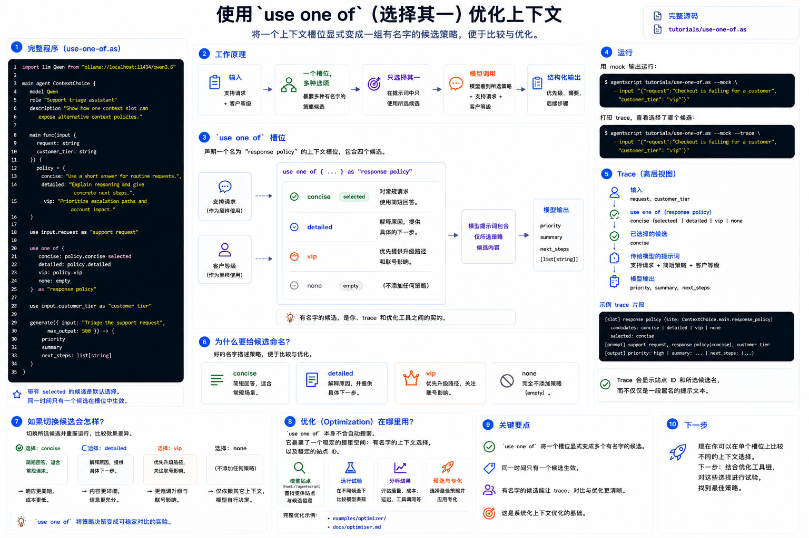

# 使用 `use one of`（选择其一）优化上下文

到目前为止，所有教程都用过 `use` 来决定模型能看到什么。`use one of` 会把这个决定显式变成一组有名字的候选项。



当你知道某个 context slot 很重要，但想比较不同策略时，它会很有用：

- concise vs. detailed
- 有 evidence vs. 没有 evidence
- 便宜 context vs. 丰富 context
- 默认行为 vs. 升级处理

完整源码：[`../../../tutorials/use-one-of.as`](../../../tutorials/use-one-of.as)

## 1. 完整程序

创建 `use-one-of.as`，或者直接打开仓库里的 `tutorials/use-one-of.as`：

```agentscript
import llm Qwen from "ollama://localhost:11434/qwen3.6"

main agent ContextChoice {
    model Qwen
    role "Support triage assistant"
    description "Show how one context slot can expose alternative context policies."

    main func(input {
        request: string
        customer_tier: string
    }) {
        policy = {
            concise: "Use a short answer for routine requests.",
            detailed: "Explain reasoning and give concrete next steps.",
            vip: "Prioritize escalation paths and account impact."
        }

        use input.request as "support request"

        use one of {
            concise: policy.concise selected
            detailed: policy.detailed
            vip: policy.vip
            none: empty
        } as "response policy"

        use input.customer_tier as "customer tier"

        generate({ input: "Triage the support request", max_output: 500 }) -> {
            priority
            summary
            next_steps: list[string]
        }
    }
}
```

## 2. 一个 Slot，多种候选

这段声明了一个名为 `"response policy"` 的 context slot：

```agentscript
use one of {
    concise: policy.concise selected
    detailed: policy.detailed
    vip: policy.vip
    none: empty
} as "response policy"
```

同一时间只有一个 candidate 生效。上面的源码里，`concise` 带有 `selected`，所以它是默认选择。

## 3. 为什么要给 Candidate 命名？

variant name 是你、trace 和 optimizer tooling 之间的契约。trace 可以说“这次选择了 `concise` variant”，而不只是展示一段匿名 prompt 文本。

好的名字描述策略：

- `concise`
- `detailed`
- `vip`
- `none`

其中 `none: empty` 表示这个 context slot 可以完全不放进 prompt。

## 4. 运行

用 mock 输出运行：

```bash
agentscript tutorials/use-one-of.as --mock --input '{"request":"Checkout is failing for a customer","customer_tier":"vip"}'
```

打印 trace，可以看到选择了哪个 variant：

```bash
agentscript tutorials/use-one-of.as --mock --trace --input '{"request":"Checkout is failing for a customer","customer_tier":"vip"}'
```

## 5. Optimization 在哪里？

`use one of` 本身不会自动搜索。它暴露的是一个稳定搜索空间：有名字的 context choices，以及稳定的 site id。

完整 optimizer 示例见：

- [`../../../examples/optimizer/`](../../../examples/optimizer/)
- [`../optimizer.md`](../optimizer.md)

那个示例使用 `host://optimizer` inspect variant sites、运行 trials，并 preview specialization。
