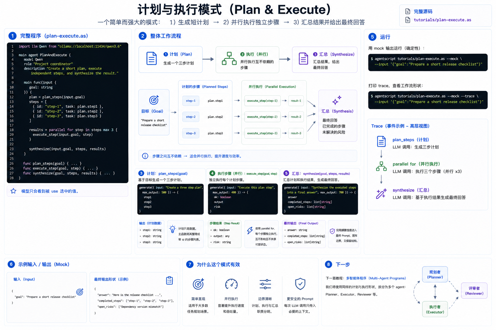

# 计划与执行

计划与执行是学习流程控制后的第一个应用模式。它的形状很简单：

1. 生成一个短计划。
2. 执行互相独立的步骤。
3. 汇总步骤结果。



这一版只使用一个 agent 和几个 helper function。Multi-agent 版本会放在 multi-agent 教程之后。

完整源码：[`../../../tutorials/plan-execute.as`](../../../tutorials/plan-execute.as)

## 1. 完整程序

创建 `plan-execute.as`，或者直接打开仓库里的 `tutorials/plan-execute.as`：

```agentscript
import llm Qwen from "ollama://localhost:11434/qwen3.6"

main agent PlanAndExecute {
    model Qwen
    role "Project coordinator"
    description "Create a short plan, execute independent steps, and synthesize the result."

    main func(input {
        goal: string
    }) {
        plan = plan_steps(input.goal)
        steps = [
            {
                id: "step-1",
                task: plan.step1
            },
            {
                id: "step-2",
                task: plan.step2
            },
            {
                id: "step-3",
                task: plan.step3
            }
        ]

        results = parallel for step in steps max 3 {
            execute_step(input.goal, step)
        }

        synthesize(input.goal, steps, results)
    }

    func plan_steps(goal) {
        use goal as "goal"

        generate({ input: "Create a three step plan", max_output: 500 }) -> {
            step1
            step2
            step3
        }
    }

    func execute_step(goal, step) {
        use goal as "goal"
        use step as "plan step"

        generate({ input: "Execute this plan step", max_output: 400 }) -> {
            ok: boolean
            output
            risk
        }
    }

    func synthesize(goal, steps, results) {
        use goal as "goal"
        use steps.summary max 1k as "planned steps"
        use results.summary max 2k as "step results"

        generate({ input: "Synthesize the executed steps into a final answer", max_output: 700 }) -> {
            answer
            completed_steps: list[string]
            open_risks: list[string]
        }
    }
}
```

## 2. Plan

`plan_steps` 是一个普通函数，只是里面有一次模型调用。它接收目标，并返回三个结构化字段：

```agentscript
generate({ input: "Create a three step plan", max_output: 500 }) -> {
    step1
    step2
    step3
}
```

计划本身只是数据。返回后，`main func` 把它整理成带 id 的 step list。

## 3. 并行执行步骤

每个 step 都可以独立执行，所以这里使用 `parallel for`：

```agentscript
results = parallel for step in steps max 3 {
    execute_step(input.goal, step)
}
```

这正好连接上一篇教程。只要每次迭代都有自己需要的输入，并且不修改共享状态，就适合用 `parallel for`。

## 4. Synthesize

最后一个函数会看到原始目标、计划步骤摘要和执行结果摘要：

```agentscript
use steps.summary max 1k as "planned steps"
use results.summary max 2k as "step results"
```

这样最终 prompt 有明确边界，同时保留 workflow 的有用结构。

## 5. 运行

用 mock 输出运行：

```bash
agentscript tutorials/plan-execute.as --mock --input '{"goal":"Prepare a short release checklist"}'
```

打印 trace，可以看到 plan 调用、`parallel for` 和最终 synthesize：

```bash
agentscript tutorials/plan-execute.as --mock --trace --input '{"goal":"Prepare a short release checklist"}'
```

## 下一步

下一篇教程会介绍多智能体程序。同样的计划与执行形状，之后可以拆成 planner、executor 和 reviewer 等多个 agent。
