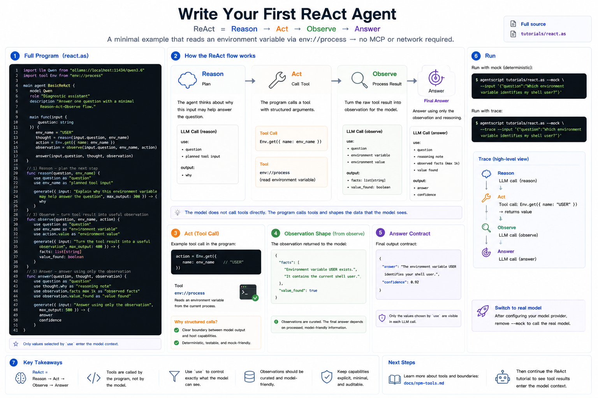

# Build a Basic ReAct Agent

ReAct means **Reason → Act → Observe**. The agent first decides what to do,
calls a tool, turns the tool result into an observation, and then answers from
that observation.



This tutorial keeps the tool simple: it reads one environment variable with
`env://process`, so you can run the example without MCP or network setup.

Full source: [`../../../tutorials/react.as`](../../../tutorials/react.as)

## 1. The Complete Program

Create `react.as` or open the repository copy at `tutorials/react.as`:

```agentscript
import llm Qwen from "ollama://localhost:11434/qwen3.6"
import tool Env from "env://process"

main agent BasicReAct {
    model Qwen
    role "Diagnostic assistant"
    description "Answer one question with a minimal Reason-Act-Observe flow."

    main func(input {
        question: string
    }) {
        env_name = "USER"
        thought = reason(input.question, env_name)
        action = Env.get({
            name: env_name
        })
        observation = observe(input.question, env_name, action)

        answer(input.question, thought, observation)
    }

    func reason(question, env_name) {
        use question as "question"
        use env_name as "planned tool input"

        generate({ input: "Explain why this environment variable may help answer the question", max_output: 300 }) -> {
            why
        }
    }

    func observe(question, env_name, action) {
        use question as "question"
        use env_name as "environment variable"
        use action.value as "environment value"

        generate({ input: "Turn the tool result into a useful observation", max_output: 400 }) -> {
            facts: list[string]
            value_found: boolean
        }
    }

    func answer(question, thought, observation) {
        use question as "question"
        use thought.why as "reasoning note"
        use observation.facts max 1k as "observed facts"
        use observation.value_found as "value found"

        generate({ input: "Answer using only the observation", max_output: 500 }) -> {
            answer
            confidence
        }
    }
}
```

## 2. Reason

`reason` is the planning step. It does not call a tool. It looks at the
question and the planned tool input, then explains why that input may help.

The important part is that `use question` is explicit. The function may receive
other values later, but only selected values enter this model call.

## 3. Act

The action is the tool call:

```agentscript
action = Env.get({
    name: env_name
})
```

The model does not call the tool directly. Your AgentScript program calls it
with structured arguments. That keeps the boundary between model output and host
capabilities visible. In this minimal tutorial, the tool input is fixed to
`"USER"` so the example stays runnable with `--mock`.

## 4. Observe

`observe` converts the raw tool result into a model-friendly observation. This
keeps the final answer from depending on an unprocessed host result.

## 5. Answer

The final step uses the original question, the reasoning note, and the observed
facts. It does not see every local variable by default; it sees only the values
selected with `use`.

## 6. Run It

Run with mock model output:

```bash
agentscript tutorials/react.as --mock --input '{"question":"Which environment variable identifies my shell user?"}'
```

Print the trace to see the Reason → Act → Observe shape:

```bash
agentscript tutorials/react.as --mock --trace --input '{"question":"Which environment variable identifies my shell user?"}'
```

To use a real model, keep the same file and run without `--mock` after your
chosen model provider is configured.
