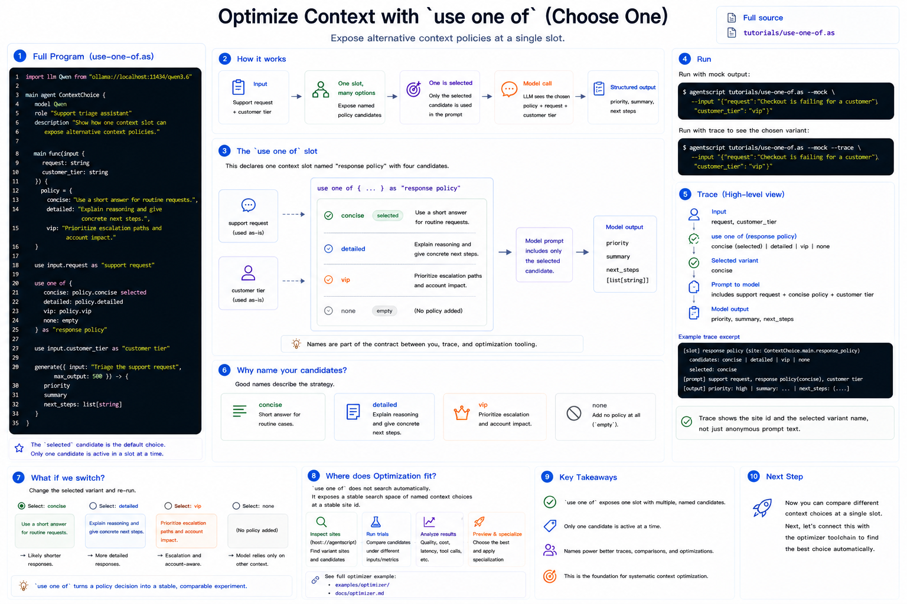

# Context Optimization With `use one of`

By now, every tutorial has used `use` to decide what the model can see. `use one
of` makes that decision explicit as a set of named alternatives.



This is useful when you know a context slot matters, but you want to compare
different policies:

- concise vs. detailed
- evidence vs. no evidence
- cheap context vs. rich context
- default behavior vs. escalation behavior

Full source: [`../../../tutorials/use-one-of.as`](../../../tutorials/use-one-of.as)

## 1. The Complete Program

Create `use-one-of.as`, or open the repository copy at `tutorials/use-one-of.as`:

```agentscript
import llm Qwen from "ollama://localhost:11434/qwen3.6"

main agent ContextChoice {
    model Qwen
    role "Support triage assistant"
    description "Show how one context slot can expose alternative context policies."

    main func(input {
        request: string
        customer_tier: string
    }) {
        policy = {
            concise: "Use a short answer for routine requests.",
            detailed: "Explain reasoning and give concrete next steps.",
            vip: "Prioritize escalation paths and account impact."
        }

        use input.request as "support request"

        use one of {
            concise: policy.concise selected
            detailed: policy.detailed
            vip: policy.vip
            none: empty
        } as "response policy"

        use input.customer_tier as "customer tier"

        generate({ input: "Triage the support request", max_output: 500 }) -> {
            priority
            summary
            next_steps: list[string]
        }
    }
}
```

## 2. One Slot, Multiple Candidates

This block declares one context slot named `"response policy"`:

```agentscript
use one of {
    concise: policy.concise selected
    detailed: policy.detailed
    vip: policy.vip
    none: empty
} as "response policy"
```

Only one candidate is active at a time. In the source above, `concise` is marked
`selected`, so it is the default.

## 3. Why Name the Candidates?

Variant names are a contract between you, traces, and optimizer tooling. A
trace can say "the `concise` variant was picked" instead of only showing an
anonymous chunk of prompt text.

Good names describe the policy:

- `concise`
- `detailed`
- `vip`
- `none`

The `none: empty` candidate means this context slot can be omitted entirely.

## 4. Run It

Run with mock output:

```bash
agentscript tutorials/use-one-of.as --mock --input '{"request":"Checkout is failing for a customer","customer_tier":"vip"}'
```

Print the trace to see which variant was picked:

```bash
agentscript tutorials/use-one-of.as --mock --trace --input '{"request":"Checkout is failing for a customer","customer_tier":"vip"}'
```

## 5. Where Optimization Fits

`use one of` does not automatically search by itself. It exposes a stable search
space: named context choices with stable site ids.

For an end-to-end optimizer example, see:

- [`../../../examples/optimizer/`](../../../examples/optimizer/)
- [`../optimizer.md`](../optimizer.md)

That example uses `host://agentscript` to inspect variant sites, run trials, and
preview a specialization.
