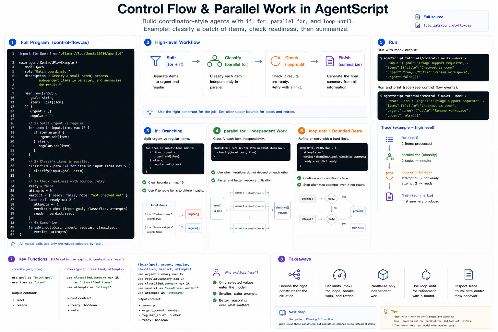

# Control Flow and Parallel Work

This tutorial introduces the control-flow tools you need before building larger
agent patterns:

- `if` for branches
- `for` for ordered work
- `parallel for` for independent work
- `loop until` for bounded retry or refinement



The example is a small batch coordinator. It splits urgent and regular items,
classifies every item independently, checks whether the batch is ready, and then
summarizes the result.

Full source: [`../../../tutorials/control-flow.as`](../../../tutorials/control-flow.as)

## 1. The Complete Program

Create `control-flow.as`, or open the repository copy at
`tutorials/control-flow.as`:

```agentscript
import llm Qwen from "ollama://localhost:11434/qwen3.6"

main agent ControlFlowExample {
    model Qwen
    role "Batch coordinator"
    description "Classify a small batch, process independent items in parallel, and summarize the result."

    main func(input {
        goal: string
        items: list[json]
    }) {
        urgent = []
        regular = []

        for item in input.items max 10 {
            if item.urgent {
                urgent.add(item)
            } else {
                regular.add(item)
            }
        }

        classified = parallel for item in input.items max 5 {
            classify(input.goal, item)
        }

        ready = false
        attempts = 0
        verdict = {
            ready: false,
            note: "not checked yet"
        }

        loop until ready max 2 {
            attempts += 1
            verdict = check(input.goal, classified, attempts)
            ready = verdict.ready
        }

        finish(input.goal, urgent, regular, classified, verdict, attempts)
    }

    func classify(goal, item) {
        use goal as "batch goal"
        use item as "item"

        generate({ input: "Classify this item for the batch goal", max_output: 300 }) -> {
            label
            reason
        }
    }

    func check(goal, classified, attempts) {
        use goal as "batch goal"
        use classified.summary max 2k as "classified items"
        use attempts as "attempt"

        generate({ input: "Decide whether the batch is ready to summarize", max_output: 300 }) -> {
            ready: boolean
            note
        }
    }

    func finish(goal, urgent, regular, classified, verdict, attempts) {
        use goal as "batch goal"
        use urgent.summary max 1k as "urgent items"
        use regular.summary max 1k as "regular items"
        use classified.summary max 2k as "classified items"
        use verdict as "readiness verdict"
        use attempts as "attempts"

        generate({ input: "Summarize the batch result", max_output: 600 }) -> {
            summary
            urgent_count: number
            regular_count: number
            ready: boolean
        }
    }
}
```

## 2. Branch With `if`

The first loop separates urgent items from regular items:

```agentscript
for item in input.items max 10 {
    if item.urgent {
        urgent.add(item)
    } else {
        regular.add(item)
    }
}
```

The `max 10` limit is deliberate. Agent workflows should have visible bounds,
especially when they may later call tools or models inside a loop.

## 3. Use `parallel for` for Independent Work

Each item can be classified independently, so the example uses `parallel for`:

```agentscript
classified = parallel for item in input.items max 5 {
    classify(input.goal, item)
}
```

Use `parallel for` when each iteration can run without depending on the previous
iteration's result. If the next item depends on the last item, use ordinary
`for`.

## 4. Use `loop until` for Bounded Refinement

`loop until` is useful when an agent needs a small retry or refinement loop:

```agentscript
loop until ready max 2 {
    attempts += 1
    verdict = check(input.goal, classified, attempts)
    ready = verdict.ready
}
```

The loop is still bounded. If `ready` never becomes true, it stops after two
attempts.

## 5. Run It

Run with mock output:

```bash
agentscript tutorials/control-flow.as --mock --input '{"goal":"Triage support requests","items":[{"title":"Checkout is down","urgent":true},{"title":"Rename workspace","urgent":false}]}'
```

Print the trace to see the `for`, `parallel for`, and `loop until` events:

```bash
agentscript tutorials/control-flow.as --mock --trace --input '{"goal":"Triage support requests","items":[{"title":"Checkout is down","urgent":true},{"title":"Rename workspace","urgent":false}]}'
```

## Next

The next pattern is Plan-and-Execute. It uses the same ideas, but turns the batch
items into planned steps.
