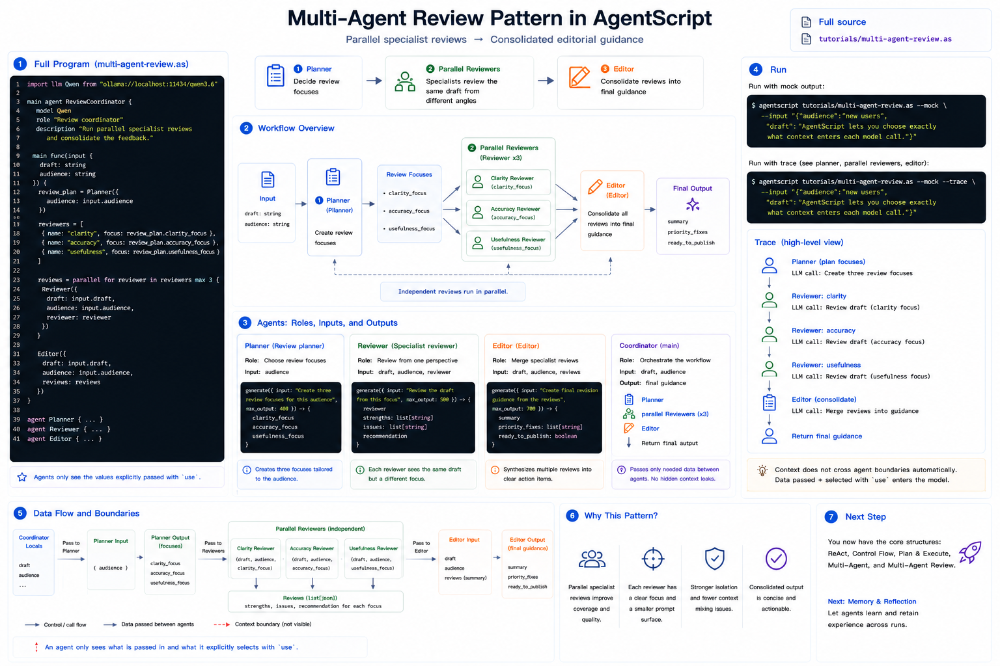

# Multi-Agent Review Pattern

The previous tutorial introduced agent boundaries. This tutorial turns those
boundaries into an application pattern: parallel specialist review.

The workflow is:

1. `Planner` chooses review focuses.
2. `Reviewer` agents review the same draft from different perspectives.
3. `Editor` consolidates the reviews into final guidance.



Full source: [`../../../tutorials/multi-agent-review.as`](../../../tutorials/multi-agent-review.as)

## 1. The Complete Program

Create `multi-agent-review.as`, or open the repository copy at
`tutorials/multi-agent-review.as`:

```agentscript
import llm Qwen from "ollama://localhost:11434/qwen3.6"

main agent ReviewCoordinator {
    model Qwen
    role "Review coordinator"
    description "Run parallel specialist reviews and consolidate the feedback."

    main func(input {
        draft: string
        audience: string
    }) {
        review_plan = Planner({
            audience: input.audience
        })

        reviewers = [
            {
                name: "clarity",
                focus: review_plan.clarity_focus
            },
            {
                name: "accuracy",
                focus: review_plan.accuracy_focus
            },
            {
                name: "usefulness",
                focus: review_plan.usefulness_focus
            }
        ]

        reviews = parallel for reviewer in reviewers max 3 {
            Reviewer({
                draft: input.draft,
                audience: input.audience,
                reviewer: reviewer
            })
        }

        Editor({
            draft: input.draft,
            audience: input.audience,
            reviews: reviews
        })
    }
}

agent Planner {
    model Qwen
    role "Review planner"
    description "Choose review focuses for a target audience."

    main func(input {
        audience: string
    }) {
        use input.audience as "audience"

        generate({ input: "Create three review focuses for this audience", max_output: 400 }) -> {
            clarity_focus
            accuracy_focus
            usefulness_focus
        }
    }
}

agent Reviewer {
    model Qwen
    role "Specialist reviewer"
    description "Review a draft from one focused perspective."

    main func(input {
        draft: string
        audience: string
        reviewer: json
    }) {
        use input.audience as "audience"
        use input.reviewer as "review focus"
        use input.draft max 2k as "draft"

        generate({ input: "Review the draft from this focus", max_output: 500 }) -> {
            reviewer
            strengths: list[string]
            issues: list[string]
            recommendation
        }
    }
}

agent Editor {
    model Qwen
    role "Editor"
    description "Merge specialist reviews into final editorial guidance."

    main func(input {
        draft: string
        audience: string
        reviews: list[json]
    }) {
        use input.audience as "audience"
        use input.draft max 2k as "draft"
        use input.reviews.summary max 3k as "specialist reviews"

        generate({ input: "Create final revision guidance from the reviews", max_output: 700 }) -> {
            summary
            priority_fixes: list[string]
            ready_to_publish: boolean
        }
    }
}
```

## 2. Plan Review Focuses

`Planner` turns the audience into three review focuses. This keeps the later
reviewers aligned without making them share one large prompt.

## 3. Run Specialist Reviewers in Parallel

Each reviewer receives the same draft and audience, but a different focus:

```agentscript
reviews = parallel for reviewer in reviewers max 3 {
    Reviewer({
        draft: input.draft,
        audience: input.audience,
        reviewer: reviewer
    })
}
```

This is a good use of `parallel for`: the clarity reviewer does not depend on
the accuracy reviewer, and both can run independently.

## 4. Consolidate With an Editor

`Editor` does not need every intermediate variable from the coordinator. It
receives only the draft, audience, and review results. Then it chooses what to
show the final model call:

```agentscript
use input.reviews.summary max 3k as "specialist reviews"
```

The pattern is useful whenever you want diverse feedback but one final answer.

## 5. Run It

Run with mock output:

```bash
agentscript tutorials/multi-agent-review.as --mock --input '{"audience":"new users","draft":"AgentScript lets you choose exactly what context enters each model call."}'
```

Print the trace to see the planner, parallel reviewers, and editor:

```bash
agentscript tutorials/multi-agent-review.as --mock --trace --input '{"audience":"new users","draft":"AgentScript lets you choose exactly what context enters each model call."}'
```

## Next

You now have the main structural tools: ReAct, control flow, Plan-and-Execute,
and multi-agent review. The next step is memory and reflection, where an agent
can persist lessons across runs.
